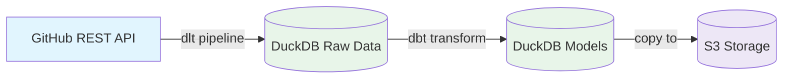

# 4d Data Pipeline

* dlt - Ingests data from sources and write to target
* duckdb - In-process SQL database for analytical queries on local data
* dbt - Framework for transforming data in duckdb for consumption



## Setup

### Install dependencies

```bash
brew install uv duckdb
uv venv
source .venv/bin/activate
uv sync
```

### Start MinIO

```bash
docker run \
   -d \
   --name minio-dlt \
   -p 9000:9000 \
   -p 9001:9001 \
   -e "MINIO_ROOT_USER=minioadmin" \
   -e "MINIO_ROOT_PASSWORD=minioadmin" \
   minio/minio server /data --console-address ":9001"
docker exec minio-dlt mc mb data/4d-pipeline
```

### Run dlt Pipeline

```bash
export SOURCES__GITHUB__ACCESS_TOKEN="<YOUR_GITHUB_PAT>"
python rest_api_pipeline.py
```

### View dlt Dashboard

```bash
dlt pipeline rest_api_github show
```
